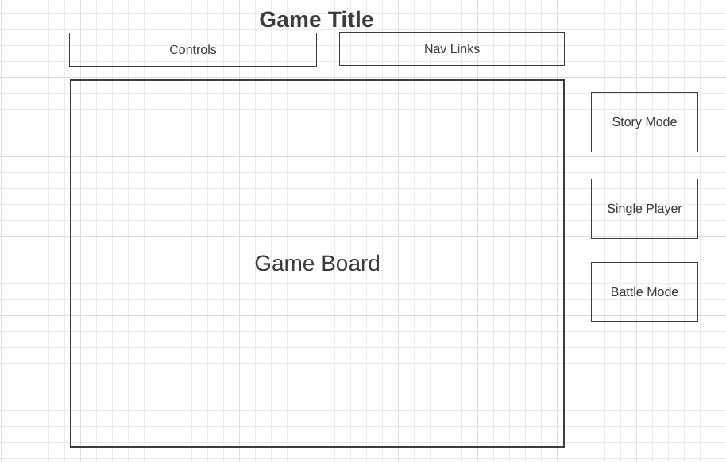

# DinoBomber
## Background
DinoBomber is a 2D javascript game, it is designed based on the concept of the classic Bobmberman game. Game will be played on a grid based map with obstacles. 
If soldiers all killed, player win. If soldier catched dino, or if dino killed itself(standing in the explosion zone) by acident, player lose. 

## Functionality & MVPs
In DinoBomber, users will be able to:
- Start, pause, and reset the game board
- Control dino to move around using keyboard(up/down/left/right)
- Drop an egg using keyboard(space)
- Trap soldiers in your explosion zone to kill them  
- Hide behind obstacles to protect dino from exposion

## To do:
- Add pause, restart option
- Make page pretty (Nav-link, game menu etc)
- Add more soldiers
- Add power-up items
- Dry up the code

## Wireframes

- Nav links include links to this project's Github repo, my LinkedIn and AngelList, and the About modal
- Game controls will include Start, Stop, and Reset buttons as well as a slider to control the speed
- (optional)On the right, there will be clickable rectangles used to toggle between color schemes
## Technologies
- Javascript
- HTML/CSS
- Canvas
- Sprite
- Tiled map editor
- Webpack

## Implementation Timeline:
- 12/31 Thursday: 
  1. Set-up the project blueprint 
  2. Create the js files for game, grid, characters, etc 
  3. Add all other necessary files, css, html, images, sprites
  4. Using webpack to organize the files
- 1/3 Monday:
  1. Using canvas to create the game board
  2. Create and add the instruction page
  3. Create and add the initial game state (with map and all characters)
  4. Set-up the baisc animation loop
- 1/4 Tuesday:
  1. Create the move function
  2. Setup the collision detection!
  3. Setup the explosion zone and safe zone
- 1/5 Wednesday:
  1. Add and render the game over page
  2. Add the power-up function
  3. Render the count of power-up on top
- 1/6 Thursday: 
- 1/7 Friday: Presentaion Date!

## Bonus Features:
Potential add-on:
- Adding more maps and game characters to choose from
- Adding battle version (player1 vs player2 or player vs AI)
- Adding differnet levels

